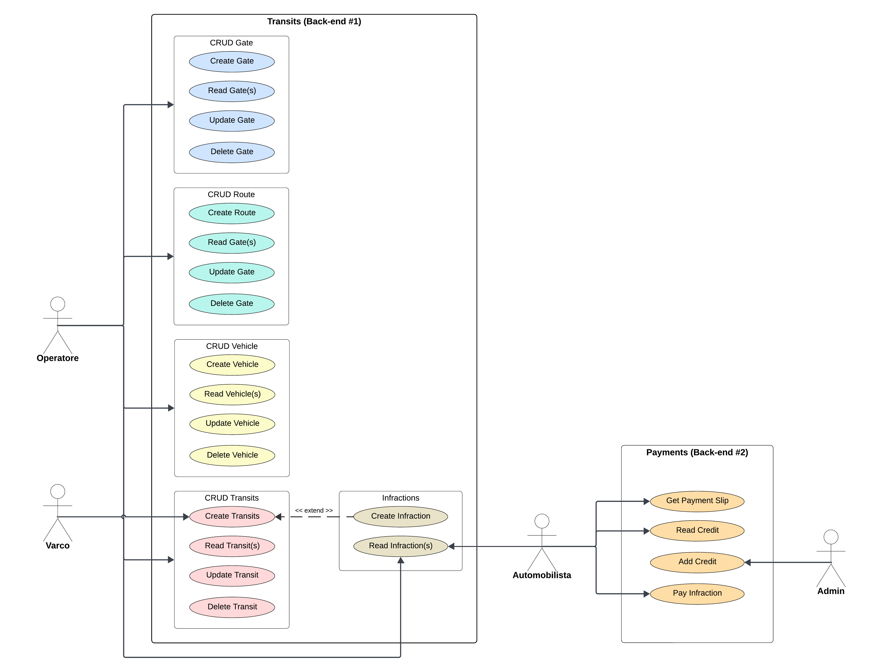
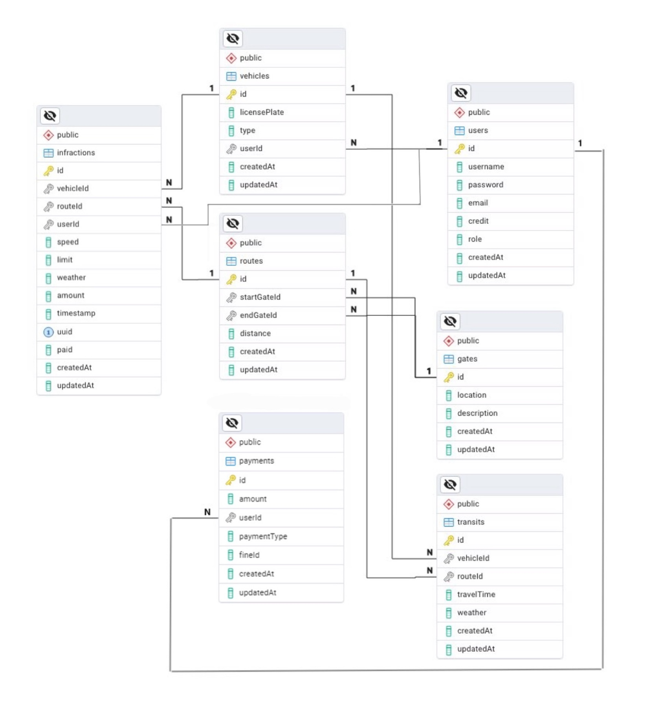
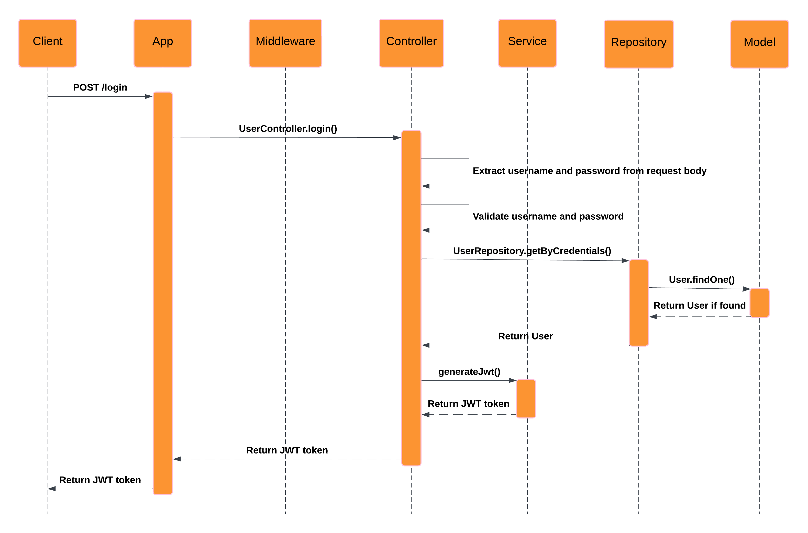
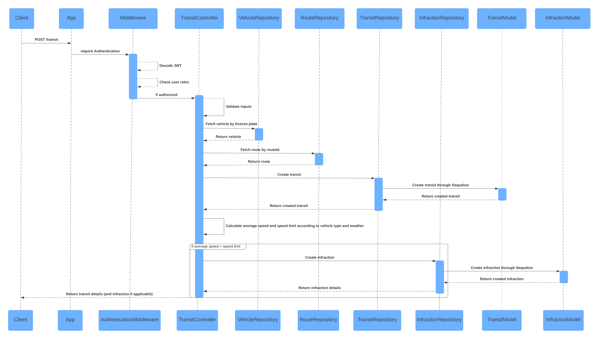

# Sistema di Gestione delle Multe Autostradali

## Obiettivo del Progetto

Il progetto ha l'obiettivo di sviluppare un sistema per la gestione delle multe derivanti dal superamento dei limiti di velocità su tratte autostradali, simile ai sistemi Tutor. Questo sistema modella diverse entità chiave:

- **Tipologie di Veicoli:** Ogni tipologia di veicolo ha limiti di velocità differenti (es. auto, camion).
- **Varchi Autostradali:** Punti di controllo con posizione geografica nota.
- **Tratte:** Percorsi definiti tra un varco di inizio e un varco di fine con una distanza specifica.

### Funzionalità Principali

1. **Gestione dei varchi:** CRUD per aggiungere, visualizzare, modificare e rimuovere varchi autostradali.
2. **Gestione delle tratte:** CRUD per gestire tratte che collegano due varchi, includendo la distanza tra essi.
3. **Gestione dei veicoli:** CRUD per gestire le informazioni sui veicoli, inclusa la loro targa e tipologia.
4. **Registrazione dei transiti:** Inserimento dei transiti con informazioni sul veicolo, tratta percorsa, tempo impiegato per percorrerla e condizioni meteorologiche (pioggia o sereno).
5. **Generazione automatica delle multe:** Calcolo automatico delle infrazioni basato sulla velocità media del veicolo tra due varchi.
6. **Query sulle multe:** Recupero delle multe in base a targa e periodo, fornendo i relativi dettagli.
7. **Generazione di bollettini di pagamento:** Creazione di bollettini di pagamento in formato PDF, includendo un QR-code con informazioni dettagliate sulla multa.
8. **Gestione dei pagamenti:** Gestione del credito degli utenti e pagamento delle multe attraverso un backend separato, con funzioni per verificare e/o verificare il creditoo.

Il sistema supporta tre ruoli distinti:

- **Operatore:** Ha pieno accesso alle operazioni di CRUD per varchi, tratte e veicoli, e può registrare transiti.
- **Varco:** Può registrare transiti.
- **Automobilista:** Può visualizzare (e pagare) solo le multe associate ai propri veicoli.

## Progettazione

### Diagramma dei Casi d'Uso



### Diagramma ER



### Pattern Utilizzati

- **MVC (Model-View-Controller)**: Il pattern MVC è stato scelto per separare la logica di business dalla presentazione e dalla gestione delle richieste. Questo permette di mantenere il codice modulare e facilmente manutenibile. Occore tuttavia fare una precisazione: ai fini del progetto la componente **View** non viene applicata non essendoci una vista vera e propria.
- **Repository Pattern**: Il Repository Pattern è stato utilizzato per astrarre la logica di accesso ai dati, fornendo una chiara separazione tra la logica di business e la logica di accesso ai dati. Questo rende il codice più testabile e manutenibile. L'interazione con il database avviene tramite Sequelize.

## Avviare il Progetto

### Prerequisiti

- Docker
- Docker-compose

### Istruzioni

1. Clonare il repository:
    ```
    git clone https://github.com/enricopierga/ProgrammazioneAvanzata2024
    cd ProgrammazioneAvanzata2024
    ```

2. Configurare le variabili d'ambiente:
    Creare un file `.env` nella radice del progetto e configurare le seguenti variabili:
    ```
    DB_NAME=defaultDb
    DB_USER=dbUser
    DB_PASS=mySecretPassword
    DB_HOST=localhost
    DB_PORT=5432
    ```

3. Avviare i servizi con Docker Compose:
    ```bash
    docker-compose up --build
    ```

4. Accedere ai servizi:
    - Backend Transiti: `http://localhost:3000`
    - Backend Pagamenti: `http://localhost:3001`

## Test del Progetto


### Postman

È possibile testare il progetto utilizzando Postman. Forniamo una collection Postman che contiene tutte le richieste necessarie per testare le API. Importare la collection in Postman e seguire le istruzioni per testare le diverse rotte.

[Scarica la Collection Postman](path_to_postman_collection.json)

### Esempi di Richieste
### Login nel sistema

**POST /login**

Per poter ottenere una risposta, il corpo delle richieste dovrà seguire il seguente modello:
  
 ```json
    {
    "username" : "pangolino",
    "password": "12345" 
    }
 ```
Il meccanismo che si innesca all'atto della chiamata è descritto dal seguente diagramma:


Se la richiesta viene effettuata correttamente viene restituito il seguente messaggio:

```json
{
    "accessToken": {
        "jwt": "MY_JWT_TOKEN"
    }
}
```
In caso di errore invece, come nel seguente caso, verrà generato un messaggio di errore assieme allo status code ad esso associato:
```json
{
    "username":"giacomo",
    "password":"PureDrive10!"
}
```
Verrà generato il seguente errore:
```json
status: 404 NOT_FOUND
{
    "message": "User not found"
}
```
### Ottenere il credito di un utente
**GET /credit**
Per poter ottenere una risposta non è necessario inserire un body, basta essere autenticati tramite JWT.
Se la richiesta viene effettuata correttamente viene restituito il seguente messaggio:

```json
{
    "balance": 50
}

```

**NOTA:** l'accesso a questa rotta è garantito agli utenti Automobilista ed Operatore.

In caso di errore invece, ovvero di utente non autorizzato, verrà generato il seguente messaggio ed il relativo status code associato:
```json
 status: 403 FORBIDDEN
{
   
    "message": "Forbidden"
}
```

### Aggiungere il credito ad un utente
**PATCH /<user_id>/credit**
Per poter ottenere una risposta non è necessario inserire un body, basta essere autenticati tramite JWT.
Se la richiesta viene effettuata correttamente viene restituito il seguente messaggio:

```json
{
    "balance": 50
}

```

**NOTA:** l'accesso a questa rotta è garantito agli utenti Automobilista ed Operatore.

In caso di errore invece, ovvero di utente non autorizzato, verrà generato il seguente messaggio ed il relativo status code associato:
```json
 status: 403 FORBIDDEN
{
   
    "message": "Forbidden"
}
```


#### CRUD per la Gestione dei Varchi
- **POST /gates**
    ```json
    {
      "location": "Location 1"
    }
    ```
- **GET /gates**
- **GET /gates/:id**
- **PUT /gates/:id**
    ```json
    {
      "location": "New Location"
    }
    ```
- **DELETE /gates/:id**

#### CRUD per la Gestione delle Tratte
- **POST /routes**
    ```json
    {
      "startGateId": 1,
      "endGateId": 2,
      "distance": 50
    }
    ```
- **GET /routes**
- **GET /routes/:id**
- **PUT /routes/:id**
    ```json
    {
      "startGateId": 1,
      "endGateId": 3,
      "distance": 55
    }
    ```
- **DELETE /routes/:id**

#### CRUD per la Gestione dei Veicoli
- **POST /vehicles**
    ```json
    {
      "licensePlate": "AB123CD",
      "type": "car",
      "userId": 1
    }
    ```
- **GET /vehicles**
- **GET /vehicles/:id**
- **PUT /vehicles/:id**
    ```json
    {
      "licensePlate": "AB123CD",
      "type": "truck"
    }
    ```
- **DELETE /vehicles/:id**

#### Inserimento Transiti e Generazione Multe
- **POST /transits**
    ```json
    {
      "licensePlate": "AA123BB",
      "routeId": 1,
      "travelTime": 3600,
      "weather": "clear"
    }
    ```
Il meccanismo che si innesca all'atto della chiamata è descritto dal seguente diagramma delle sequenze:



#### Richiesta Multe per Targa e Periodo
- **POST /infractions/plates-and-period**
    ```json
    {
      "plates": ["AB123CD", "EF456GH"],
      "startDate": "2024-01-01",
      "endDate": "2024-07-21"
    }
    ```

#### Scaricare Bollettino di Pagamento
- **GET /payments/:id/pdf**
- 
#### Effettuare un Pagamento
- **POST /payments**
    ```json
    {
      "paymentUuid": "6836178f-0c79-4c10-88ec-75bae54fd6a4",
    }
    ```

### Conclusione

Questo progetto implementa un sistema completo per la gestione delle multe autostradali con ruoli differenziati, utilizzando pattern architetturali solidi e tecnologie moderne. Seguire le istruzioni per avviare e testare il sistema e garantire la corretta configurazione delle variabili d'ambiente e dei servizi Docker.
